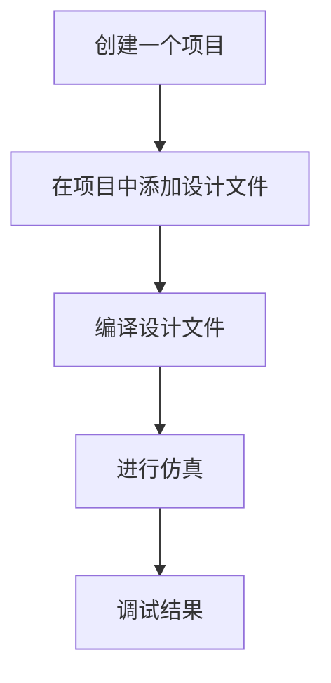

# 2.3 逻辑功能的仿真验证过程

-  仿真（Simulation）
	为了确认设计是否合乎需求规格（功能、性能…）,利用计算机平台进行验证的一种手段或技术。
	仿真工具：ModelSim
-   综合（Synthesis）
		将用行为和功能层次描述的电子系统转换为低层次的、便于具体实现的模块组合装配的过程。
	-  高位综合(HLS)：将算法级描述转换为寄存器传输级（Register Transport Level， RTL）描述，即从行为域到结构域的综合。
	-  逻辑综合：从RTL级描述转换为门级（包括触发器）的表述。


HDL产生的最初动因就是为了能够模拟硬件系统，可以分析系统的性能，验证其功能是否正确。       

要测试一个设计块是否正确，就要用Verilog再写一个测试模块。这个测试模块应包括以下三个方面的内容：

-  测试模块中要调用到设计块，只有这样才能对它进行测试；
-  测试模块中应包含测试的激励信号源；
-  测试模块能够实施对输出信号的检测，并报告检测结果；

写出测试模块的过程又称为搭建测试平台（test bench）


## 测试激励块与设计块之间的关系

```verilog
module mux2to1(out,a,b,sel);
input a,b,sel;
output out; 
    ...
endmodule


module test_mux;
  reg a,b,s;
  wire out;
  mux2to1 u1(out, a, b, s);
endmodule


```

- 仿真时，信号线a、b、s上要加一组测试激励信号，这组激励信号的产生，是通过initial内部的过程语句产生的，而过程语句只能给reg型变量赋值。
- 仿真时，信号线a、b、s上的激励信号是不能消失的，需要有“寄存”效应，能够描述这种“寄存”行为的，只能是reg型。

## 仿真验证的过程

基于工程项目仿真的基本流程



