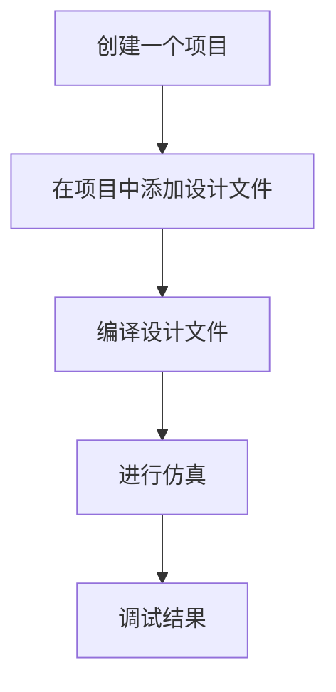

[TOC]

# ch02-Verilog HDL入门

## 2.1 硬件描述语言简介

硬件描述语言(HDL)一种以文本形式来描述数字系统硬件的结构和行为的语言。

用它可以表示逻辑电路图、逻辑表达式，复杂数字逻辑系统的逻辑功能。

用HDL编写设计说明文档易于存储和修改，并能被计算机识别和处理.

HDL是高层次自动化设计的起点和基础.目前， IEEE推出两种标准：VHDL和Verilog HDL

### VHDL和Verilog HDL的起源与发展

略

### 两种语言的比较

- VHDL

  - 能力

    - 结构建模
    - 抽象能力强
    - 系统级－算法级－RTL级－逻辑级－门级

  - 数据类型

    - 是一种数据类型性极强的语言。支持用户定义的数据类型

    - 当对象的数据类型不一样时必须用类型转换函数转换

    - 可以使用抽象（比如枚举）类型为系统建模

    - 能利用数据类型检查编程的错误

  - 易学性

    是一种数据类型很强的语言，欠直观。加之同一种电路有多种建模方法，通常需要一定的时间和经验，才能高效的完成设计。
    VHDL根植于ADA，有时简洁，有时冗繁，如行为描述简洁，结构描述冗繁。

  - 效率

    由于数据类型严格，模型必须精确定义和匹配数据类型，这造成了比同等地verilog效率要低。

- Verilog

  - 能力

    - 结构建模
    - 具体物理建模能力强
    - 算法级－RTL级－逻辑级－门级－版图级

  - 数据类型

    - 数据类型简单
    - 只能由语言本身定义，不能由用户定义
    - 适于硬件结构的建模，不适于抽象的硬件行为建模

  - 易学性

    由于Verilog为直接仿真语言，数据类型较简单，语法很直观，故Verilog更易理解和好学。
    Verilog更像C，约有50％的结构来自C，其余部分来自ADA。

  - 效率

    不同位宽的信号可以彼此赋值，较小位数的信号可以从大位数信号中自动截取自己的位号。在综合过程中可以删掉不用的位，这些特点使之简洁，效率较高。

### 新进展

- VHDL
  - OO-VHDL
  - DE-VHDL
- Verilog HDL
  - Verilog-AMS
  - SystemVerilog

## 2.2 Verilog HDL程序的基本结构

- 大约100个预定义的关键词
- Verilog HDL程序由模块构成。每个模块的内容都是嵌在关键词module和endmodule两个语句之间。每个模块实现特定的功能。
- 每个模块先要进行端口的定义，并说明输入（input) 、输出（output)和双向（inout)，然后对模块功能进行描述。
- 除了endmodule语句外，每个语句后必须有分号。
- 可以用/* --- */和//…..，对VerilogHDL程序的任何部分做注释。

### 模块定义的一般语法结构

```verilog
module modulename(port1,port2,port3,...)
//说明部分   
    //端口类型说明(input,output,inout)
    input ...;
    output ...;
    ...
    //参数定义(可选)
    
    //数据类型定义(可选)
    wire wire1,wire2;
    
//逻辑功能描述部分，其顺序是任意的
    
    assign ...//连续赋值语句(assign);
        
        
    initial begin//过程块结构
        ...//行为描述语句
    end    
      
endmodule
```


### 三种描述风格

- 结构描述（门级描述）方式

一般使用Primitive（内部元件）、自定义的下层模块对电路描述。主要用于层次化设计中。

- 数据流描述方式

一般使用assign语句描述，主要用于对组合逻辑电路建模。

- 行为描述方式

一般使用always和initial语句描述，可以对组合、时序逻辑电路建模。

#### 门级（结构）风格

```verilog
/* Gate-level description of a half adder */
module HalfAdder_GL(A,
                    B,
                    Sum,
                    Carry);
    input  A ,B ;		//输入端口声明
    output  Sum, Carry ;      //输出端口声明
    
    wire A ,B , Sum ,Carry ;
    
    xor X1 (Sum, A, B);
    and A1 (Carry, A, B);
endmodule
```

#### 数据流风格

```verilog
/* Dataflow description of a half adder */
module HalfAdder_DF(A,
                    B,
                    Sum,
                    Carry);
    input  A ,B ;
    output  Sum ,Carry ;
    wire A ,B，Sum ,Carry ;
    assign   Sum   = A ^ B;
    assign   Carry = A & B;
endmodule
```

#### 行为风格

```verilog
/* Behavioral description of a half adder */
module HalfAdder_BH(A,
                    B,
                    Sum,
                    Carry);
    input  A ,B ;
    output  Sum ,Carry ;
    reg Sum ,Carry ;    //声明端口数据类型为寄存器
    always @(A or B)  begin
        Sum = A ^ B;	//用过程赋值语句描述�?�辑功能
        Carry = A & B;
    end
endmodule

```


## 2.2.1  简单Verilog HDL程序实例

### 半加器

逻辑图如下


#### 门级风格

```verilog
/* Gate-level description of a half adder */
module HalfAdder_GL(A, B, Sum, Carry);
  input  A ,B ;		//输入端口声明
  output  Sum, Carry ;      //输出端口声明

  wire A ,B , Sum ,Carry ; 
  
  xor X1 (Sum, A, B );
  and A1 (Carry, A, B);  
endmodule

```

#### 数据流风格

```verilog
/* Dataflow description of a half adder */
module HalfAdder_DF(A, B, Sum, Carry);
  input  A ,B ;	 	 
  output  Sum ,Carry ; 
  wire A ,B，Sum ,Carry ; 
  assign   Sum = A ^ B; 
  assign   Carry = A & B; 
 endmodule

```

#### 行为风格

```verilog
/* Behavioral description of a half adder */
module HalfAdder_BH(A, B, Sum, Carry);
  input  A ,B ;	 	  
  output  Sum ,Carry ; 
  reg Sum ,Carry ;    //声明端口数据类型为寄存器
  always @(A or B)  begin
	Sum = A ^ B;	//用过程赋值语句描述逻辑功能
	Carry = A & B;
  end
endmodule

```

### 2选1数据选择器


#### 结构描述(门级描述)

```verilog
module mux2to1(a, b, sel, out);
  input a, b, sel; //定义输入信号
  output out; //定义输出信号
  wire selnot,a1,b1; //定义内部节点信号数据类型
 //下面对电路的逻辑功能进行描述
  not U1(selnot, sel);
  and U2(a1, a, selnot);
  and U3(b1, b, sel);
  or  U4(out, a1, b1); 
 endmodule
```

#### 数据流描述

```verilog
module mux2_1(out, a, b, sel) ;
    output   out;
    input  a, b;
    input sel;
    
assign out= sel ? b : a;

endmodule
```

```verilog
module mux2_1(out, a, b, sel) ;
    output   out;
    input  a, b;
    input sel;
    
assign out=(sel & b) | (~sel & a);

endmodule
```

#### 行为描述

```verilog
module mux2_1(out, a, b, sel) ;
    output   out;
    input  a, b;
    input sel;
     reg out;

always @(sel or a or b)
  begin
      if (sel) 
                  out = b;
      else     out = a;
  end
endmodule

```

```verilog
module mux2_1(out, a, b, sel) ;
    output   out;
    input  a, b;
    input sel;
     reg out;
always @(sel or a or b)
begin
    case (sel)
        1’b0 :  out = a;
        1’b1 :  out = b;
    endcase
end
endmodule

```


## 2.3 逻辑功能的仿真验证过程

-  仿真（Simulation）
   为了确认设计是否合乎需求规格（功能、性能…）,利用计算机平台进行验证的一种手段或技术。
   仿真工具：ModelSim
-  综合（Synthesis）
   	将用行为和功能层次描述的电子系统转换为低层次的、便于具体实现的模块组合装配的过程。
   -  高位综合(HLS)：将算法级描述转换为寄存器传输级（Register Transport Level， RTL）描述，即从行为域到结构域的综合。
   -  逻辑综合：从RTL级描述转换为门级（包括触发器）的表述。


HDL产生的最初动因就是为了能够模拟硬件系统，可以分析系统的性能，验证其功能是否正确。       

要测试一个设计块是否正确，就要用Verilog再写一个测试模块。这个测试模块应包括以下三个方面的内容：

-  测试模块中要调用到设计块，只有这样才能对它进行测试；
-  测试模块中应包含测试的激励信号源；
-  测试模块能够实施对输出信号的检测，并报告检测结果；

写出测试模块的过程又称为搭建测试平台（test bench）


### 测试激励块与设计块之间的关系

```verilog
module mux2to1(out,a,b,sel);
input a,b,sel;
output out; 
    ...
endmodule


module test_mux;
  reg a,b,s;
  wire out;
  mux2to1 u1(out, a, b, s);
endmodule


```

- 仿真时，信号线a、b、s上要加一组测试激励信号，这组激励信号的产生，是通过initial内部的过程语句产生的，而过程语句只能给reg型变量赋值。
- 仿真时，信号线a、b、s上的激励信号是不能消失的，需要有“寄存”效应，能够描述这种“寄存”行为的，只能是reg型。

### 仿真验证的过程

基于工程项目仿真的基本流程




## 2.4 Modelsim仿真软件的使用

略


## 2.5  Verilog HDL功能仿真常用命令 

### 2.5.1系统任务（System Tasks） 

#### display

display是Verilog中最有用的任务之一，用于将指定信息（被引用的字符串、变量值或者表达式）以及结束符显示到标准输出设备上。

```verilog
$dispaly("带格式字符串"，参数1，参数2);
```

| 格式符(不区分大小写) | 显示说明                                   |
| -------------------- | ------------------------------------------ |
| %d                   | 用十进制显示变量                           |
| %b                   | 用二进制显示变量                           |
| %o                   | 用八进制显示变量                           |
| %h                   | 用十六进制显示变量                         |
| %v                   | 显示强度                                   |
| %t                   | 显示目前时间格式                           |
| %s                   | 显示字符串                                 |
| %c                   | 显示ASCII字符                              |
| %m                   | 显示层次名                                 |
| %e                   | 用科学技术方式显示实数（如3e10）           |
| %f                   | 用十进制方式显示实数                       |
| %g                   | 选择科学计数和十进制方式中较短的来显示实数 |

#### write

write与display格式相同，都为显示任务。区别在于write在显示信息的最后不需要指定回车符，可以自行输出回车。

```verilog
$write("带格式字符串",参数1,参数2)
```

#### monitor

monitor可以持续监视一个或多个信号值发生改变的情况。仿真中调用monitor任务或监视参数发生变化时，仿真器就会输出指定信息。

任何时刻，都只能有一个监视任务处于活动状态。

```verilog
$monitor(“带格式字符串”,参数1,参数2,…);
$monitoroff;
$monitoron;
```

#### stop和finish

```verilog
$stop；//在仿真期间，停止执行，未退出仿真环境。
$finish；//仿真完成，退出仿真环境，并将控制权返回给操作系统
```

系统任务stop使得仿真进入交互模式，然后设计者可以进行调试。当设计者希望检查信号的值时，就可以使用stop使仿真器被挂起。然后可以发送交互命令给仿真器继续仿真。 

#### time

```verilog
$time //返回一个64位整数时间值。
$stime //返回一个32位整数时间值
$realtime //返回一个实数时间值
$timeformat //控制时间的显示方式
//-----------------------------------------
$monitor("%d d=%b,e=%b",$stime,d,e);
```

#### 文件系统任务

```verilog
文件句柄=$fopen("文件名")//打开文件
$fstrobe(文件句柄，“带格式字符串”，参数列表)//strobe到文件
$fdisplay(文件句柄，“带格式字符串”，参数列表t)//display到文件
$fmonitor(文件句柄，“带格式字符串”，参数列表t)//monitor到文件，可以多个进程
$fwrite(文件句柄，“带格式字符串”，参数列表t)//write到文件
$fclose(文件句柄)//关闭文件
$fscanf(文件句柄，“带格式字符串”，参数列表)//从文件中读取一行

$dumpfile("文件名")//导出到文件，这里文件后缀为vcd
$dumpvar//导出当前设计的所有变量
$dumpvar(1,top)//导出顶层模块中的所有变量
$dumpvar(2,top)//导出顶层模块和顶层下第1层模块中的所有变量
$dumpvar(n-1,top)//导出顶层模块和顶层下第n-1层模块中的所有变量
$dumpvar(0,top)//导出顶层模块和所有层次模块的所有变量
$dumpon//导出初始化
$dumpoff//停止导出
```

```verilog
module fileio_demo;
integer fp_r, fp_w, cnt;
reg [7:0] reg1, reg2, reg3;
initial begin
	fp_r = $fopen(“in.txt”, “r”);
	fp_w = $fopen(“out.txt”, “w”);
	while(!$feof(fp_r)) begin
		cnt = $fscanf(fp_r, “%d %d %d”, reg1, reg2, reg3);
		$display(“%d %d %d”, reg1, reg2, reg3);
		$fwrite(fp_w, “%d %d %d”, reg3, reg2, reg1);
	end
	$fcolse(fp_r);
	$fclose(fp_w);
end
endmodule

```

### 2.5.2 编译器指令(Compiler Directives)

​      以 `（反撇号，用键盘上左边与~共用的键输入）开头的标识符就是编译指令，用来控制代码的整个过程。在Verilog代码编译的整个过程中，编译器指令始终有效（编译过程可能跨越多个文件），直至遇到其他不同的编译器指令为止。  

```verilog
`timescale time_unit/time_precision
`include "../../header.v "
`define  WORD_SIZE  32 //定义文本宏
`undef  WORD_SIZE  32 //取消定义文本宏
`ifdef, `ifndef, `else, `elsif, `endif

//综合开关
// synthesis translate_off
$display(….);
// synthesis translate_on

```

### 2.5.3 延时说明

```verilog
# 延时时间单位数
# (上升延迟，下降延迟)
# (上升延迟，下降延迟,转换到z的延迟)
```


