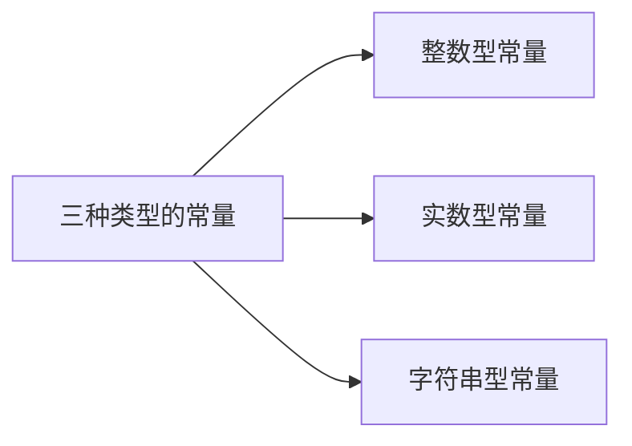
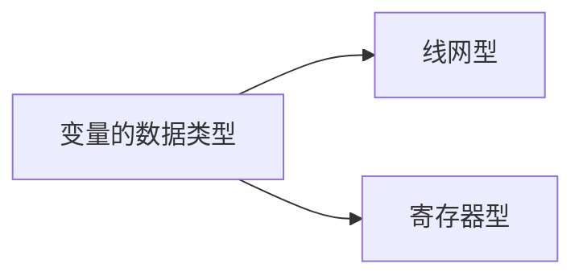

[TOC]


# 3.1  Verilog HDL基本语法规则

## 3.1.1 词法规定

- 分隔符

Verilog 的间隔符主要起分隔文本的作用，可以使文本错落有致，便于阅读与修改。
间隔符包括空格符（\b）、TAB 键（\t）、换行符（\n）及换页符。

- 注释符

注释只是为了改善程序可读性，编译时不起作用。

```verilog
/*多行注释符(用于写多行注释):*/
//单行注释符：以//开始到行尾结束为注释文字。
```


- 标识符

给对象（如模块名、电路的输入与输出端口、变量等）取名所用的字符串。

由英文字母、数字、**$**符和下划线组成。

以英文字母或下划线开始。

**区分大小写。**

- 关键词

用Verilog语言本身规定的特殊字符串定义语言的结构。

关键词都是小写。

关键词不能作为标识符使用 。

## 3.1.2 逻辑值集合

为了表示数字逻辑电路的逻辑状态，Verilog语言规定了
4种基本的逻辑值。

| 逻辑值类型 | 含义                   |
| ---------- | ---------------------- |
| 0          | 逻辑0、逻辑假          |
| 1          | 逻辑1、逻辑真          |
| x(X)       | 不确定的值（未知状态） |
| z(Z)       | 高阻态                 |

## 3.1.3 常量及其表示




### 整数型常量

- 十进制数形式表示
  - 有符号常量。
  - 如：30、-2

- 带基数形式表示
  - <+/-><位宽>'<基数符号(b,o,d,n)><数值>
  - 如：3'b101、5'o37、8'he3、8'b1001_0011

- 十进制数形式表示

  

- 有符号常量。如：30、-2

- 带基数形式表示：

<+/-><位宽>'<基数符号(b,o,d,n)><数值>

### 实数型常量

- 十进制计数法
  - 如：0.1、2.0、5.67

- 科学计数法
  - 如：23_5.1e2（23510.0）、5E-4（0.0005）


---

整数型常量和实数型常量不可综合，仅可仿真。

---

### 字符串常量

- 字符串是用双撇号括起来的字符序列。

- 必须包含在同一行中，不能分成多行书写。

- 如：

```verilog
    "this is a string";
    "hello world!"
```

### 符号常量

Verilog 允许用参数定义语句定义一个标识符来代表一个常量，称为符号常量。

定义格式：

```verilog
parameter 参数名1=常量表达式1,参数2=常量表达式2
//--------------------------------------------
parameter BIT=1,BYTE=8,PI=3.14
```

### 3.1.4数据类型



#### 线网型

输出始终根据输入的变化更新其值。一般指硬件电路的各种物理连接。

```verilog
wire [n-1,0] 变量名1，变量名2，…，变量名n;
//--------------------------------------------
L=a&b;//a、b的值发生变化，线网L的值会立即跟着变化。
```

---

多重驱动：在写**可综合**的Verilog代码时，建议不要对同一个变量进行多次赋值（简称多重驱动），以避免出现多个信号同时驱动一个输出变量的情况。


---

| 线网类型   | 功能说明                                                     |
| ---------- | ------------------------------------------------------------ |
| wire,tri   | 用于描述单元（元件）之间的连线，wire为一般连线；tri用于描述由多个信号源驱动的线网，并没有其他特殊意义，两者的功能完全相同。 |
| wor,trior  | 具有线或特性的线网，用于一个线网被多个信号驱动的情况。       |
| wand,riand | 具有线或特性的线网，用于一个线网被多个信号驱动的情况。       |
| trireg     | 具有电荷保持特性的线网，用于开关级建模                       |
| tir1       | 上拉电阻，用于开关级建模                                     |
| tir0       | 下拉电阻，用于开关级建模                                     |
| supply1    | 用于对电源建模，高电平1                                      |
| supply0    | 用于对地建模，低电平0                                        |


#### 寄存器型

- 对应具有状态保存作用的电路的元件
- 如触发器、寄存器
- 只能在initial或always内部被赋值

| 寄存器类型    | 功能说明               |
| ------------- | ---------------------- |
| reg           | 常用的寄存器型变量     |
| integer       | 32位带符号的整数型变量 |
| real/realtime | 64位带符号的实数型变量 |
| time          | 64位无符号的时间变量   |

一般只用reg和integer

```verilog
reg clock;
reg [3:0] counter;
```


## 门级建模

### 多输入门

```verilog
Gate_name <instance>(Output,Input1,Input2,...)
```

或、与、异或及他们的非

基本门级元件实例化名称可省

调用多次？

### 多输出门

### 三态门


## 数据流建模与运算符

### 运算符

| 名称              | 符号                 |
| ----------------- | -------------------- |
| 算术（*注意优化） | +,-,*,/,%            |
| 位（双目）        | ~,&,\|,^,^~(~^)      |
| 缩位（单目）      | &,~&,\|,~\|,^,~^(^~) |
| 逻辑              | !,&&,\|\|            |
| 关系              | <,>,<=,>=            |
| 想等、全等        | ==,!=,===,!==        |
| 逻辑移位          | <<,>>                |
| 位拼接            | {}                   |
| 条件              | ?:                   |

## 行为建模

体现功能和算法。

### if-else 语句

### case

```verilog
case (case_expr)
    2'd0:Y=D[0];
    2'd1:
        begin
            Y=D[2];
            Y2=D[2];
        end
    default:Y=D[1];
endcase
```

### for循环

硬件设计电路中，for循环的每一次都是独立的电路，会导致电路规模过大，且由于执行是串行的，会导致延迟变长。

``` verilog
for(k=0;k<=7;k=k+1)
```