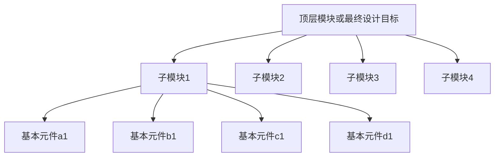

# 3.5 分层次的电路设计方法

## 3.5.1  设计方法

- 分层次建模就是将一个比较复杂数字电路划分为多个组成模块，分别对每个模块建模，然后将这些模块组合成一个总模块，完成所需的功能。
-  通常有自顶向下（top-down）和自底向上（bottom-up）
  - 自顶向下:先将最终设计目标定义成顶层模块，再按一定方法将顶层模块划分成各个子模块，然后对子模块进行逻辑设计。
  - 自底向上: 由基本元件构成的各个子模块首先被确定下来，然后将这些子模块组合起来构成顶层模块，最后得到所要求的电路。




名称关联法（端口多时建议使用）

```verilog
halfadder HA1(.B(B1),.S(S1),.C(D1),.A(A));
```

位置关联法

```verilog
halfadder HA1(B1),S1,.D1,.A);
```


## 模块实例化引用语句

```verilog
module_name instance_name (port_association);
```

## 模块引用注意事项

- 只能？，不能以循环方式嵌套模块，即不能再always语句内部引用子模块。

- 实例引用的子模块可以是

  - Verilog HDL设计文件
  - FPGA元件库中一个元件或元件功能块
  - 别的HDL语言设计的元件
  - IP核

- 两种端口关联方法不能混合使用

- 输入输出端口的数据类型

  

  

  

  

  