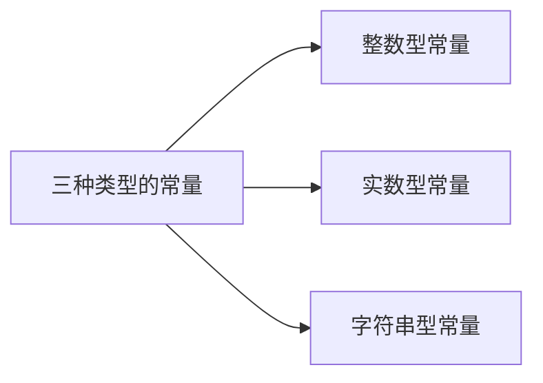
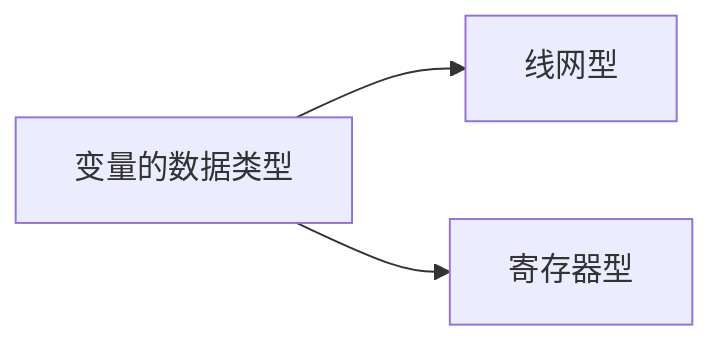
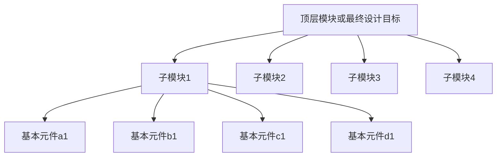

[TOC]

# ch03-Verilog HDL基础与组合电路建模

# 3.1  Verilog HDL基本语法规则

## 3.1.1 词法规定

- 分隔符

Verilog 的间隔符主要起分隔文本的作用，可以使文本错落有致，便于阅读与修改。
间隔符包括空格符（\b）、TAB 键（\t）、换行符（\n）及换页符。

- 注释符

注释只是为了改善程序可读性，编译时不起作用。

```verilog
/*多行注释符(用于写多行注释):*/
//单行注释符：以//开始到行尾结束为注释文字。
```


- 标识符

给对象（如模块名、电路的输入与输出端口、变量等）取名所用的字符串。

由英文字母、数字、**$**符和下划线组成。

以英文字母或下划线开始。

**区分大小写。**

- 关键词

用Verilog语言本身规定的特殊字符串定义语言的结构。

关键词都是小写。

关键词不能作为标识符使用 。

## 3.1.2 逻辑值集合

为了表示数字逻辑电路的逻辑状态，Verilog语言规定了
4种基本的逻辑值。

| 逻辑值类型 | 含义                   |
| ---------- | ---------------------- |
| 0          | 逻辑0、逻辑假          |
| 1          | 逻辑1、逻辑真          |
| x(X)       | 不确定的值（未知状态） |
| z(Z)       | 高阻态                 |

## 3.1.3 常量及其表示




### 整数型常量

- 十进制数形式表示

  - 有符号常量。
  - 如：30、-2

- 带基数形式表示

  - <+/-><位宽>'<基数符号(b,o,d,n)><数值>
  - 如：3'b101、5'o37、8'he3、8'b1001_0011

- 十进制数形式表示

  

- 有符号常量。如：30、-2

- 带基数形式表示：

<+/-><位宽>'<基数符号(b,o,d,n)><数值>

### 实数型常量

- 十进制计数法
  - 如：0.1、2.0、5.67

- 科学计数法
  - 如：23_5.1e2（23510.0）、5E-4（0.0005）


---

整数型常量和实数型常量不可综合，仅可仿真。

---

### 字符串常量

- 字符串是用双撇号括起来的字符序列。

- 必须包含在同一行中，不能分成多行书写。

- 如：

```verilog
    "this is a string";
    "hello world!"
```

### 符号常量

Verilog 允许用参数定义语句定义一个标识符来代表一个常量，称为符号常量。

定义格式：

```verilog
parameter 参数名1=常量表达式1,参数2=常量表达式2
//--------------------------------------------
parameter BIT=1,BYTE=8,PI=3.14
```

### 3.1.4数据类型



#### 线网型

输出始终根据输入的变化更新其值。一般指硬件电路的各种物理连接。

```verilog
wire [n-1,0] 变量名1，变量名2，…，变量名n;
//--------------------------------------------
L=a&b;//a、b的值发生变化，线网L的值会立即跟着变化。
```

---

多重驱动：在写**可综合**的Verilog代码时，建议不要对同一个变量进行多次赋值（简称多重驱动），以避免出现多个信号同时驱动一个输出变量的情况。


---

| 线网类型   | 功能说明                                                     |
| ---------- | ------------------------------------------------------------ |
| wire,tri   | 用于描述单元（元件）之间的连线，wire为一般连线；tri用于描述由多个信号源驱动的线网，并没有其他特殊意义，两者的功能完全相同。 |
| wor,trior  | 具有线或特性的线网，用于一个线网被多个信号驱动的情况。       |
| wand,riand | 具有线或特性的线网，用于一个线网被多个信号驱动的情况。       |
| trireg     | 具有电荷保持特性的线网，用于开关级建模                       |
| tir1       | 上拉电阻，用于开关级建模                                     |
| tir0       | 下拉电阻，用于开关级建模                                     |
| supply1    | 用于对电源建模，高电平1                                      |
| supply0    | 用于对地建模，低电平0                                        |


#### 寄存器型

- 对应具有状态保存作用的电路的元件
- 如触发器、寄存器
- 只能在initial或always内部被赋值

| 寄存器类型    | 功能说明               |
| ------------- | ---------------------- |
| reg           | 常用的寄存器型变量     |
| integer       | 32位带符号的整数型变量 |
| real/realtime | 64位带符号的实数型变量 |
| time          | 64位无符号的时间变量   |

一般只用reg和integer

```verilog
reg clock;
reg [3:0] counter;
```


## 门级建模

### 多输入门

```verilog
Gate_name <instance>(Output,Input1,Input2,...)
```

或、与、异或及他们的非

基本门级元件实例化名称可省

调用多次？

### 多输出门

### 三态门


## 数据流建模与运算符

### 运算符

| 名称              | 符号                 |
| ----------------- | -------------------- |
| 算术（*注意优化） | +,-,*,/,%            |
| 位（双目）        | ~,&,\|,^,^~(~^)      |
| 缩位（单目）      | &,~&,\|,~\|,^,~^(^~) |
| 逻辑              | !,&&,\|\|            |
| 关系              | <,>,<=,>=            |
| 想等、全等        | ==,!=,===,!==        |
| 逻辑移位          | <<,>>                |
| 位拼接            | {}                   |
| 条件              | ?:                   |

## 行为建模

体现功能和算法。

### if-else 语句

### case

```verilog
case (case_expr)
    2'd0:Y=D[0];
    2'd1:
        begin
            Y=D[2];
            Y2=D[2];
        end
    default:Y=D[1];
endcase
```

### for循环

硬件设计电路中，for循环的每一次都是独立的电路，会导致电路规模过大，且由于执行是串行的，会导致延迟变长。

``` verilog
for(k=0;k<=7;k=k+1)
```


# 3.2  Verilog HDL门级建模

- 结构级建模

就是根据逻辑电路的结构（逻辑图），实例引用Verilog HDL中内置的基本门级元件或者用户定义的元件或其他模块，来描述结构图中的元件以及元件之间的连接关系。

- 门级建模

Verilog HDL中内置了12个基本门级元件（Primitive，有的翻译为“原语”）模型，引用这些基本门级元件对逻辑图进行描述，也称为门级建模。  

## 3.2.0 基本门级元件

| 类别               | 原语名称                       | 说明                                  |
| ------------------ | ------------------------------ | ------------------------------------- |
| 多输入门           | and、nand、or、nor、xor、xnor  | 只有单个输出,一个或多个输入           |
| 多输出门           | not、buf                       | 允许有多个输出，但只有一个输入        |
| 三态门             | bufif0、bufif1、notif0、notif1 | 有一个输出,一个数据输入和一个控制输入 |
| 上拉电阻和下拉电阻 | pullup、pulldown               | /                                     |


## 3.2.1 多输入门

```verilog
gate_name <instance> (OutputA.Input1,Input2,..,InputN);
```

| 原语名称 | 图形符号                                                     | 逻辑表达式         |
| -------- | ------------------------------------------------------------ | ------------------ |
| and      |  | $L=A \& B$         |
| nand     |  | $L=\sim(A \& B)$   |
| or       |  | $L=A|B$            |
| nor      |  | $L=\sim(A | B)$    |
| xor      |  | $L=A\wedge B$      |
| xnor     |  | $L=A\sim \wedge B$ |


### 基本门的调用方法举例

``` verilog
and    A1(out，in1，in2，in3);
xnor  NX1(out，in1，in2，in3，in4);
```

- 对基本门级元件，调用名A1、NX1可以省略。 
- 若同一个基本门在当前模块中被调用多次，可在一条调用语句中加以说明，中间以逗号相隔。 （？）

- and、nand真值表:


## 3.2.2 多输出门

允许有多个输出，但只有一个输入

```verilog
buf  B1（out1，out2，…，in）;
not  N1（out1，out2，…，in）;
```

buf真值表


not真值表


## 3.2.3 三态门

有一个输出、一个数据输入和一个输入控制。
如果输入控制信号无效，则三态门的输出为高阻态z。 

### bufif1


### notif1


## 3.2.4  门级建模举例

### 2选1数据选择器


```verilog
//Gate-level description
module _2to1muxtri (a,b,sel,out);
   input a,b,sel;
   output out;
   tri out;
   bufif1 (out,b,sel);
   bufif0 (out,a,sel);
 endmodule 

```

### 1位全加器

```verilog
module addbit (a, b, ci, sum, co);           
input   a,  b,  ci;                           
output  sum,  co;                         
wire   a, b, ci, sum, co, n1, n2, n3; 
     xor   u0(n1, a, b,)，               
              u1(sum, n1, ci);            
     and   u2(n2, a, b)，                  
              u3(n3, n1, ci);               
     or      (co, n2, n3);           
endmodule                                           
```

### 小结

1. 给电路图中的每个输入输出引脚  赋以端口名.
2. 给电路图中每条内部连线取上各自的连线名.
3. 给电路图中的每个逻辑元件取一个编号 (即“调用名”).
4. 给所要描述的这个电路模块确定一个模块名.
5. 用module定义相应模块名的结构描述,并将逻辑图中所有的输入输出端口名列入端口名表项中,再完成对各端口的输入输出类型说明.
6. 依照电路图中的连接关系,确定各单元之间端口信号的连接,完成对电路图内部的结构描述.
7. 最后用endmodule结束模块描述全过程.


# 3.3  Verilog HDL数据流建模与运算符

- 对于基本单元逻辑电路，使用Verilog语言提供的门级元件模型描述电路非常方便。 
- 但随着电路复杂性的增加，使用的逻辑门较多时，使用HDL门级描述的工作效率就很低。
- 数据流建模能够在较高的抽象级别描述电路的逻辑功能，并且通过逻辑综合软件，能够自动地将数据流描述转换成为门级电路。 
- 数据流建模主要使用逻辑表达式，所以要了解各种运算符和表达式。

## 3.3.1 数据流建模

数据流建模使用的连续赋值语句，由关键词assign开始，后面跟着由操作数和运算符等组成的逻辑表达式。

一般用法

```verilog
wire [位宽说明]变量名1，变量名2,...,变量名n;
assign 变量名=表达式
```

注：

assign 语句只能对wire型变量进行赋值，所以等号左边变量名的数据类型必须是wire型。

- 举例

$$
Y=D_0\cdot \overline{S}+D_1 \cdot S
$$


```verilog
module mux2to1_dataflow(D0, D1, S, Y );
  input D0, D1, S;  
  output Y;
  wire Y ; 

//下面是逻辑功能描述
  assign Y = (~S & D0) | (S & D1);  //表达式左边Y必须是wire型

endmodule                       

```

## 3.3.2  运算符及其优先级

### 运算符

共9类

| 运算符分类         | 所含运算符                                                   |
| ------------------ | ------------------------------------------------------------ |
| 算术运算符         | $+\quad \quad -\quad \quad *\quad \quad /\quad \quad %$      |
| 位运算符           | $\sim \quad \quad\& \quad\quad \wedge \quad\quad \wedge \sim 或\sim \wedge$ |
| 缩位运算符(单目）  | $\&　\quad\quad \sim \& \quad\quad | \quad\quad \sim | \quad\quad \wedge \quad\quad \wedge \sim 或\sim \wedge$ |
| 逻辑运算符         | $! \quad\quad \&\& \quad\quad \|$                            |
| 关系运算符（双目） | $< \quad\quad > \quad\quad <= \quad\quad >=$                 |
| 相等与全等运算符   | $== \quad\quad != \quad\quad === \quad\quad!==$              |
| 逻辑移位运算符     | $<< \quad\quad >>$                                           |
| 位拼接运算符       | $\{\}$                                                       |
| 条件运算符         | $?:$                                                         |

### 位拼接运算符

作用是将两个或多个信号的某些位拼接起来成为一个新的操作数，进行运算操作。

设A=1’b1，B=2’b10，C=2’b00

则
$$
\{B,C\}＝4’b1000\\
\{A,B[1],C[0]\}＝3’b110\\
\{A,B,C,3’b101\}=8’b11000101\\
$$
对同一个操作数的重复拼接还可以双重大括号构成的运算符{{}}

如
$$
\{4\{A\}\}=4’b1111\\
\{2\{A\},2\{B\},C\}=8’b11101000
$$

### 位运算符与缩位运算的比较

设A：4’b1010 、B：4’b1111

| 位运算结果              | 缩位运算结果     |
| ----------------------- | ---------------- |
| ~A = 0101<br/>~B = 0000 | &A=1&0&1&0=0     |
| A&B=1010                | ~&A=1<br/>&B=1   |
| A\|B=1111               | \|A=1<br/>~\|B=0 |
| A^B=0101                | ^A=0<br/>^B=0    |
| A~^B=1010               | ~^A=1<br/>~^B=1  |

### 相等与全等运算符

有四种：

＝＝（逻辑相等），    !＝（逻辑不等）
＝＝＝（条件全等），!＝＝（条件不全等） 

a、b的初值同为4‘b0100，c和d的初值同为4’b10x0

| a==b     | a!=b     | a===b     | a!==b     |
| -------- | -------- | --------- | --------- |
| **1**    | **0**    | **1**     | **0**     |
| **c==d** | **c!=d** | **c===d** | **c!==d** |
| **x**    | **x**    | **1**     | **0**     |

### 条件运算符

是三目运算符，运算时根据条件表达式的值选择表达式。

一般用法

```verilog
condition_expr?expr1:expr2;
```

首先计算第一个操作数condition_expr的值，如果结果为逻辑1，则选择第二个操作数expr1的值作为结果返回，结果为逻辑0，选择第三个操作数expr2的值作为结果返回。

### 运算符的优先级

| **类型** | **符号**                           |
| -------- | ---------------------------------- |
| **取反** | ! ~ -(求2的补码)                   |
| **算术** | *** /**  **+   -**                 |
| **移位** | **>> <<**                          |
| **关系** | **< <= >   >=**                    |
| **等于** | **== !=**                          |
| **缩位** | **& ~&**  **^   ^~**  **\|   ~\|** |
| **逻辑** | **&&**  **\|\|**                   |
| **条件** | **?:**                             |


# 3.4  组合电路的行为级建模

行为级建模就是描述数字逻辑电路的功能和算法。

在Verilog中，行为级描述主要使用由关键词initial或always定义的过程语句。一个模块的内部可以包含多个initial或always语句。 

initial语句是一条初始化语句，仅执行一次，经常用于测试模块中，对激励信号进行描述，在硬件电路的行为描述中，有时为了仿真的需要，也用initial语句给寄存器变量赋初值。
initial语句主要是一条面向仿真的过程语句，不能用于逻辑综合 。

过程语句中包含一系列过程赋值语句。

## 3.4.1 行为级建模基础

### always语句的一般用法

```verilog
always @(事件控制表达式)
begin：块名
   块内局部变量的定义；
   过程赋值语句（包括高级语句）;
end

```

-  “@”称为事件控制运算符，用于挂起某个动作，直到事件发生。“事件控制表达式”也称为敏感事件表，它是后面begin和end之间的语句执行的条件。当事件发生或某一特定的条件变为“真”时，后面的过程赋值语句就会被执行。
-  begin…end 之间只有一条语句时，关键词可以省略；
-  begin…end 之间的多条语句被称为顺序语句块。可以给语句块取一个名字，称为有名块。语句块中赋值语句除了具有顺序特性外，还具有并行特性。
-  不同的always语句之间具有并行性。

### 条件语句（ if语句）

条件语句就是根据判断条件是否成立，确定下一步的运算。

Verilog语言中有3种形式的if语句

```verilog
if (condition_expr) true_statement;

if (condition_expr)true_statement;
else fale_ statement;

if (condition_expr1) true_statement1;
else if (condition_expr2) true_statement2;
	else if (condition_expr3) true_statement3;
             ……
		else default_statement;


```

if后面的条件表达式一般为逻辑表达式或关系表达式。执行if语句时，首先计算表达式的值，若结果为0、x或z，按“假”处理；若结果为1，按“真”处理，并执行相应的语句。 

实例：4选1数据选择器


```verilog
module mux4to1_bh(D, S, Y);  
   input [3:0] D;  //输入端口
   input [1:0] S;  //输入端口
   output reg Y;  //输出端口及变量数据类型
   always @(D, S) //电路功能描述
     if (S == 2’b00)        Y = D[0];  
     else if (S== 2’b01)  Y = D[1];
     else if (S== 2’b10)  Y = D[2];
     else                           Y = D[3];
endmodule 

```

注意，过程赋值语句只能给寄存器型变量赋值，因此，输出变量Y的数据类型定义为reg。

### 多路分支语句（case语句）

是一种多分支条件选择语句，一般形式如下

```verilog
case (case_expr)
       item_expr1: statement1;
       item_expr2: statement2;
        ……
      default: default_statement; //default语句可以省略
endcase

```

注意：

- 当分支项中的语句是多条语句，必须在最前面写上关键词begin，在最后写上关键词end，成为顺序语句块。
- 另外，用关键词casex（忽视X及Z的比较）和casez（忽视Z的比较）表示含有无关项x和高阻z的情况。  

实例：4选1数据选择器

```verilog
//例：对具有使能端En 的4选1数据选择器的行为进行Verilog描述。当En=0时，数据选择器工作，En=1时，禁止工作，输出为0。 
module mux4to1_bh (D, S, Y,En); 
  input [3:0] D，[1:0] S；  input  En;
  output  reg  Y；
  always @(D, S, En)  //2001, 2005 syntax
  begin
   if (En==1)  Y = 0; //En=1时，输出为0
   else             //En=0时，选择器工作
     case (S) 
       2’d0: Y = D[0];
       2’d1: Y = D[1];
       2’d2: Y = D[2];
       2’d3: Y = D[3];
     endcase
  end
endmodule 

```

### for循环语句

一般形式

```verilog
for (initial_assignment; condition; step_assignment)  
           statement；
```

- initial_assignment 为循环变量的初始值。
- condition为循环的条件，
  - 若为真，执行过程赋值语句statement，
  - 若不成立，循环结束，执行for后面的语句。
- step_assignment为循环变量的步长，每次迭代后，循环变量将增加或减少一个步长。

实例：3线-8线译码器

```verilog
module ecoder3to8_bh(A,En,Y);
       input [2:0] A，En; 
       output reg  [7:0]Y;
       integer k;         //声明一个整型变量k
       always @(A, En)   //
          begin
               Y = 8’b1111_1111;     //设译码器输出的默认值
              for(k = 0; k <= 7; k = k+1) //下面的if-else语句循环8次
                     if ((En==1) && (A== k) ) 
                          Y[k] = 0;   //当En=1时，根据A进行译码
                     else
                          Y[k] = 1;   //处理使能无效或输入无效的情况
          end
    endmodule 
```


# 3.5 分层次的电路设计方法

## 3.5.1  设计方法

- 分层次建模就是将一个比较复杂数字电路划分为多个组成模块，分别对每个模块建模，然后将这些模块组合成一个总模块，完成所需的功能。
- 通常有自顶向下（top-down）和自底向上（bottom-up）
  - 自顶向下:先将最终设计目标定义成顶层模块，再按一定方法将顶层模块划分成各个子模块，然后对子模块进行逻辑设计。
  - 自底向上: 由基本元件构成的各个子模块首先被确定下来，然后将这些子模块组合起来构成顶层模块，最后得到所要求的电路。




### 两种关联方法

- 名称关联法

端口多时建议使用名称关联法，不易出错

```verilog
halfadder HA1(.B(B1),.S(S1),.C(D1),.A(A));
//格式：  .形式名称(实际名称)
```

- 位置关联法

父模块与子模块的端口信号是按照位置（端口排列次序）对应关联的

```verilog
halfadder HA1(B1,S1,.D1,.A);
```


## 3.5.2 模块实例化引用语句

模块实例引用语句的格式

```verilog
module_name instance_name (port_association);
```

### 模块引用注意事项

- 模块只能以实例引用的方式嵌套在其他模块内，嵌套的层次是没有限制的。但不能在一个模块内部使用关键词module和endmodule去定义另一个模块，也不能以循环方式嵌套模块，即不能在always语句内部引用子模块。

- 实例引用的子模块可以是

  - Verilog HDL设计文件
  - FPGA元件库中一个元件或元件功能块
  - 别的HDL语言设计的元件
  - IP核

- 两种端口关联方法不能混合使用

- 输入输出端口的数据类型

  

  

  

  

  # 常用组合逻辑电路及其设计

  ## 编码器

  

  ### 数据流风格

  ```verilog
  module Encoder8x3a(En,I,Y,GS);
    input En;
    input [7:0] I;
    output [2:0] Y;
    output  GS;
    
    assign Y[2] = En & (I[7] | I[6] | I[5] | I[4]);
    assign Y[1] = En & (I[7] | I[6] | ((~I[5]) &(~I[4]) & (~I[3])) | ((~I[5]) &(~I[4]) & (~I[2])));
    assign Y[0] = En & (I[7] | (~I[6]&I[5]) | ((~I[6]) &(~I[4]) & I[3]) | ((~I[6]) &(~I[4]) & (~I[2])&I[1]));
    assign GS = En & (I[7] | I[6] | I[5] | I[4] | I[3] | I[2] | I[1] | I[0]);
  endmodule
  
  ```

  ### 行为描述

  #### case语句实现

  ```verilog
  module Encoder8x3b(En,I,Y,GS);
    input En;
    input [7:0] I;
    output [2:0] Y;
    output GS;
    reg [2:0] Y;
    reg GS;
      always@(I or En)//对于组合逻辑电路，时间控制表达式必须包含always语句中所有输入变量
    begin
        if (~En) begin
            out_coding = 3’b000; GS = 1’b0;
        end
        else begin//对于组合逻辑电路，if与else必须对应齐全
            casez(I)
                8’b1???_????: 
                begin Y = 3’b111; GS = 1’b1; end
                8’b01??_????: begin Y = 3’b110; GS = 1’b1; end
                8’b001?_????: begin Y = 3’b101; GS = 1’b1; end
                8’b0001_????: begin Y = 3’b100; GS = 1’b1; end
                8’b0000_1???: begin Y = 3’b011; GS = 1’b1; end
                8’b0000_01??: begin Y = 3’b010; GS = 1’b1; end
                8’b0000_001?: begin Y = 3’b001; GS = 1’b1; end
                8’b0000_0001: begin Y = 3’b000; GS = 1’b1; end
                8’b0000_0000: begin Y = 3’b000; GS = 1’b0; end
                default: begin Y = 3’b000; GS = 1’b0; end//对于组合逻辑电路，分支语句必须包含所有组合，建议养成最后添加default的习惯
           endcase
        end 
    end
  endmodule
  
  ```

  #### if-else语句实现

  ```verilog
  module Encoder8x3b(En,I,Y,GS);
    input En;
    input [7:0] I;
    output [2:0] Y;
    output GS;
    reg [2:0] Y;
    reg GS;
    always@(I or En)
    begin
        if (~En) begin Y = 3’b000; GS = 1’b0; end
        else if (I7) begin Y = 3’b111; GS = 1’b1; end
        else if (I6) begin Y = 3’b110; GS = 1’b1; end
        else if (I5) begin Y = 3’b101; GS = 1’b1; end
        else if (I4) begin Y = 3’b100; GS = 1’b1; end
        else if (I3) begin Y = 3’b011; GS = 1’b1; end
        else if (I2) begin Y = 3’b010; GS = 1’b1; end
        else if (I1) begin Y = 3’b001; GS = 1’b1; end
        else if (I0) begin Y = 3’b000; GS = 1’b1; end
        else           begin Y = 3’b000; GS = 1’b0; end
     end
  end module
  
  
  ```

  二者功能相同但不代表产生的电路相同

  - case语句每个分支是并行的，独立进行判断
  - if-else是带有优先级的，各个输出的延迟时间不同，但电路规模比case语句小

  #### 循环语句实现

  这种实现方法更接近if-else

  ```verilog
  module Encoder8x3c(En,I,Y,GS);
    input En;
    input [7:0] I;
    output [2:0] reg Y;
    output reg GS;
    
    integer k;
  
    always@(I or En)
    begin
        if (!En) begin
   	Y = 3’b000; GS = 1’b0;
        end
        else begin
            Y = 3’b000;
            GS = 1’b0;
            for (k=7;k>=0;k=k-1)
  	if I[k] == 1’b1) begin Y = k; GS = 1’b1; end
       end
    end
  endmodule
  
  ```

  

  ## 译码器

  

  ### 数据流风格

  ```verilog
  module Decoder3x8a(A, En, Y);
    input [2:0] A;
    input En;
    output [7:0] Y;
    
    assign Y[0] = ~(En & ~A[2] & ~A[1] & ~A[0]);
    assign Y[1] = ~(En & ~A[2] & ~A[1] & A[0]);
    assign Y[2] = ~(En & ~A[2] & A[1] & ~A[0]);
    assign Y[3] = ~(En & ~A[2] & A[1] & A[0]);
    assign Y[4] = ~(En & A[2] & ~A[1] & ~A[0]);
    assign Y[5] = ~(En & A[2] & ~A[1] & A[0]);
    assign Y[6] = ~(En & A[2] & A[1] & ~A[0]);
    assign Y[7] = ~(En & A[2] & A[1] & A[0]);
  
  endmodule
  
  ```

  

  ### 行为描述

  ```verilog
  module Decoder3x8b(A, En, Y);//case语句实现
    input [2:0] A;
    input En;
    output [7:0] Y;
  
    reg [7:0] Y;
    
    always@(A or En)
    begin
        if (~En) Y = 8’b1111_1111;
        else
            case(A)
                3’d0: Y = 8’b1111_1110;              3’d1: Y = 8’b1111_1101;
                3’d2: Y = 8’b1111_1011;              3’d3: Y = 8’b1111_0111;
                3’d4: Y = 8’b1110_1111;              3’d5: Y = 8’b1101_1111;
                3’d6: Y = 8’b1011_1111;              3’d7: Y = 8’b0111_1111;
                default: Y= 8’bxxxx_xxxx;
            endcase
       end
  end module
  
  
  ```

  ```verilog
  module Decoder3x8c(A, En, Y);//循环语句实现
    input [2:0] A;
    input En;
    output [7:0] Y;
  
    reg [7:0] Y;
    integer k;
    
    always@(A or En)
    begin
        Y = 8’b1111_1111;//这一句不合规范，硬件描述语言不应该出现初始化一类的东西
        for (k=0; k<=7; k=k+1)
            if ((en == 1’b1) && (A==k))
                Y[k] = 1’b0;
            else
                Y[k] = 1’b1;
     end
  end module
  
  
  ```

  ## 七段显示译码器 

  ``` verilog
  module SEG7_LUT(oSEG, iDIG);
    input [3:0] iDIG;
    output [6:0] oSEG;
    reg [6:0] oSEG;
    
    always@(iDIG)
    begin
          case(iDIG)
                4’h0: oSEG = 7’b100_0000;              4’h1: oSEG = 7’b111_1001;
                4’h2: oSEG = 7’b010_0100;              4’h3: oSEG = 7’b011_0000;
                4’h4: oSEG = 7’b001_1001;              4’h5: oSEG = 7’b001_0010;
                4’h6: oSEG = 7’b000_0010;              4’h7: oSEG = 7’b111_1000;
                4’h8: oSEG = 7’b000_0000;              4’h9: oSEG = 7’b001_1000;
                4’hA: oSEG = 7’b000_1000;              4’hB: oSEG = 7’b000_0011;
                4’hC: oSEG = 7’b100_0110;              4’hD: oSEG = 7’b010_0001;
                4’hE: oSEG = 7’b000_0110;              4’hF: oSEG = 7’b000_1110;
                default: oSEG= 8’bxxxx_xxxx;
            endcase
       end
  end module
  
  
  ```

  ## 二进制数与8421BCD码的转换

  ### 四位二进制数转换成二个BCD码

  ```verilog
  module _4bitBIN2BCD(Bin, BCD1,BCD0);
    input [3:0] Bin;
    output [3:0] BCD1,BCD0;
  
    reg [3:0] BCD1,BCD0;
    
    always@(Bin)
    begin
        if (Bin<4’d10) begin
  	BCD1 = 4’h0;
  	BCD0 = Bin;
        end
        else begin
  	BCD1 = 4’h1;
  	BCD0 = Bin – 4’d10;		//BCD0 = Bin + 3’h6;此种电路规模应略简单些
        end
    end
  end module
  
  //BCD码转换电路用七段数码管显示 
  module _4bitBIN2SEG7(SW, HEX1,HEX0);
    input [3:0] SW;
    output [6:0] HEX1,HEX0;
  
    wire [3:0] BCD1,BCD0;
    
    _4bitBin2bcd 	B0(SW, BCD1, BCD0);
    SEG7_LUT 	U0(HEX0,BCD0);
    SEG7_LUT	U1(HEX1,BCD1);
  end module
  
  ```

  ### 八位二进制数转换成三个BCD码

  - 算法一：每4位分开转换，再求和
    - 将低4位转换成BCD码，例如：4’b1100 -> 12’h012;
    - 将高4位转换成BCD码，例如：8’b1111_0000 -> 12’h240;
    - 对两次转换的BCD码求和，即得到真实的BCD码；例如：8’b1111_1100 -> 12’h012 + 12’h240 = 12’h252
    - 求和时，两个BCD的和可能大于9，需要再加上6进行修正。
  - 算法二：移位加3算法
    - 在8位二进制数的左侧依次拼接百位、十位、个位BCD列（每列4位）；
    - 把二进制数向左移动1位；
    - 移位后，如果百位、十位、个位的BCD列中的任何一个二进制数大于或等于5，相应BCD列的数值加3；
    - 重复步骤2-3共8次；
    - 最后得到的百位、十位、个位的数值即是所求三个BCD数

  

  

  